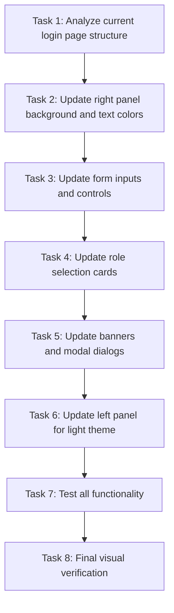

# Login Page Theme Update Tasks

## Task Dependency Graph

## Tasks

### Task 1: Analyze current login page structure
**Description**: Review the current LoginPage.tsx file to identify all color-related classes that need updating.
**Sub-tasks**:
1. Identify all background color classes (`bg-[#...]`, `bg-paper`, etc.)
2. Identify all text color classes (`text-white`, `text-zinc-300`, etc.)
3. Identify all border color classes (`border-zinc-800`, etc.)
4. Document the mapping from dark to light theme colors
**Acceptance Criteria**:
- Complete list of color classes requiring updates
- Mapping plan for dark-to-light conversions

### Task 2: Update right panel background and text colors
**Description**: Update the right panel (authentication portal) from dark to light theme.
**Sub-tasks**:
1. Change right panel container from `bg-[#0B0F19]` to `bg-white`
2. Update header text colors from `text-white` to `text-zinc-900`
3. Update paragraph text from `text-zinc-400` to `text-zinc-600`
4. Update labels from `text-zinc-300` to `text-zinc-700`
**Acceptance Criteria**:
- Right panel uses light background (`bg-white`)
- All text has appropriate contrast on light background
- Visual hierarchy maintained

### Task 3: Update form inputs and controls
**Description**: Update all form elements to light theme.
**Sub-tasks**:
1. Update email input from `bg-[#121826] text-white` to `bg-white text-zinc-900`
2. Update password/PIN inputs with same light theme
3. Update shift dropdown to light theme
4. Update checkbox styling for light theme
5. Update "Forgot PIN / Access?" link color
6. Update submit button (keep gradient but ensure it works in light theme)
**Acceptance Criteria**:
- All form inputs have white backgrounds and dark text
- All interactive elements remain clearly visible
- Submit button gradient preserved

### Task 4: Update role selection cards
**Description**: Update the role selection cards to light theme with proper hover states.
**Sub-tasks**:
1. Update unselected role cards from `bg-[#121826] border-zinc-800/90 text-zinc-400` to `bg-white border-zinc-200 text-zinc-600`
2. Update selected role cards from `bg-[#182035] border-ink text-white` to `bg-zinc-50 border-ink text-zinc-900`
3. Update hover states for unselected cards
4. Update icon backgrounds and colors
**Acceptance Criteria**:
- Role cards use light theme with proper visual states
- Selected state clearly indicated
- Hover effects work properly

### Task 5: Update banners and modal dialogs
**Description**: Update all banners and modal dialogs to light theme.
**Sub-tasks**:
1. Update quick demo banner from `bg-indigo-950/40 border-indigo-900/60` to `bg-indigo-50 border-indigo-200`
2. Update error banner from `bg-red-950/60 border-red-800/80 text-red-200` to `bg-red-50 border-red-200 text-red-700`
3. Update forgot credentials modal to light theme
4. Update modal backgrounds and text colors
**Acceptance Criteria**:
- All banners use light theme variants
- Modal dialogs use light backgrounds
- Error and success states remain clearly visible

### Task 6: Update left panel for light theme
**Description**: Ensure left panel (brand showcase) works properly with light theme.
**Sub-tasks**:
1. Review left panel text colors for proper contrast
2. Adjust background image opacity if needed
3. Update metrics cards to match dashboard styling
4. Ensure bottom telemetry section has proper contrast
**Acceptance Criteria**:
- Left panel text has sufficient contrast on light/transparent backgrounds
- Background image doesn't interfere with readability
- Visual consistency maintained

### Task 7: Test all functionality
**Description**: Test that all login functionality works after theme updates.
**Sub-tasks**:
1. Test role selection functionality
2. Test form submission with valid/invalid credentials
3. Test quick demo login buttons
4. Test forgot credentials modal flow
5. Test responsive behavior on different screen sizes
**Acceptance Criteria**:
- All login functionality works as before
- No broken event handlers or state issues
- Responsive design intact

### Task 8: Final visual verification
**Description**: Perform final visual checks to ensure theme matches dashboard.
**Sub-tasks**:
1. Compare login page with dashboard components side-by-side
2. Verify color consistency across all elements
3. Check for any visual regressions
4. Ensure accessibility standards met (contrast ratios)
**Acceptance Criteria**:
- Login page visually matches dashboard theme
- No visual inconsistencies or regressions
- Accessibility requirements met